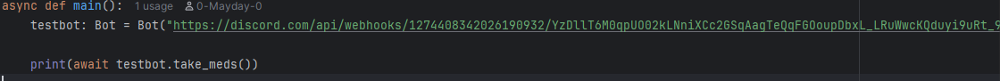

# Personal project

---

# What it does:
>This project defines a Bot class with regex verification and an internal menu for quick posting of messages to a Discord channel.

---

Below is an example of how to instantiate a Bot object (this is just an example URL, and it does not post, however it displays the correct format for a webhook URL)

# Additional examples can be found in *main.py* in the repository, with proper .env file handling.